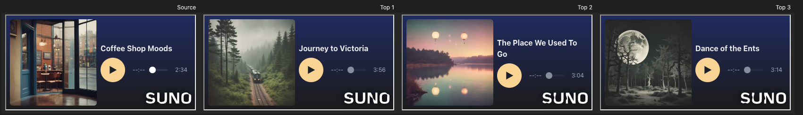
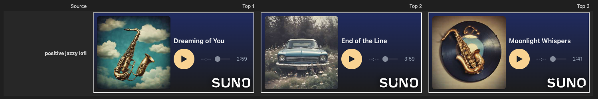

# 👏🏻 CLAP-MusicGen 🎵

CLAP-MusicGen is a contrastive audio-text embedding model that combines the strengths of Contrastive Language-Audio Pretraining (CLAP) with Meta's [MusicGen](https://github.com/facebookresearch/audiocraft/blob/main/docs/MUSICGEN.md) as the audio encoder. Users can generate latent embeddings for any given audio or text, enabling downstream tasks like music similarity search and audio classification.

**Note** that this is a **proof-of-concept** project and is not aimed at providing the highest quality embeddings but rather at demonstrating the idea, as it is my personal pet project.

## Table of Contents
- [👨‍🏫 Overview](#-overview)
- [🏗️ Model Architecture](#-model-architecture)
- [📀 Training Data](#-training-data)
- [💻 Quick Start](#-quick-start)
- [🎧 Similarity Search Demo](#-similarity-search-demo)
- [🤿 Training / Evaluation Deep Dives](#-deeo-dives)
- [🖇️ References](#-references)
- [🪪 License](#-license)

## 👨‍🏫 Overview
CLAP-MusicGen is a multimodal model designed to enhance music retrieval capabilities. By embedding both audio and text into a shared space, it enables efficient music-to-music and text-to-music search. Unlike traditional models limited to predefined categories, CLAP-MusicGen supports zero-shot classification, retrieval, and embedding extraction, making it a valuable tool for exploring and organizing music collections.
### Key Capabilities:
- **MusicGen-based Audio Encoding:** Uses **MusicGen** to extract high-quality audio embeddings.
- **Two-way Retrieval:** Supports searching for audio given an input audio or text.

## 🏗️ Model Architecture
CLAP-MusicGen consists of:
1. **Audio Encoder:** Uses **MusicGen’s decoder** for feature extraction given the tokenization inputs from **EnCodec**.

2. **Text Encoder:** A pretrained RoBERTa **finetuned on the music styles/genres text** with MLM objective.

3. **Projection Head:** A multi-layer perceptron (MLP) that projects both text and audio embeddings into the same space.

4. **Contrastive(ish) Learning:** Trained using a **listwise ranking loss** instead of traditional contrastive loss to optimize the alignment between text and audio embeddings, enhancing retrieval performance for tasks like music similarity search.

## 📀 Training Data
The model is trained on the [nyuuzyou/suno](https://huggingface.co/datasets/nyuuzyou/suno) dataset from Hugging Face. This dataset includes approximately **10K** curated audio-caption pairs, split into 80% training, 10% validation, and 10% evaluation. Captions are derived from the `metadata.tags` field, which provides descriptions of musical styles and genres. Note that one can include the full prompt from `metadata.prompt` along with style tags for training, to achieve an even richer audio/text embeddings supervised by the full captions.

*Note: since our CLAP model is trained using AI-generated music-caption pairs from Suno, forming a synthetic data loop where an AI learns from another AI’s outputs, it presents potential biases of training on AI-generated data, opening up opportunities for further refinement by incorporating human-annotated music datasets.*

## 💻 Quick Start

### Installation

To install the necessary dependencies, run:

```bash
pip install torch torchvision torchaudio transformers
```

### Loading the Model from 🤗 Hugging Face

First, clone the project repository and navigate to the project directory:

```python
from src.modules.clap_model import CLAPModel
from transformers import RobertaTokenizer

model = CLAPModel.from_pretrained("yuhuacheng/clap-musicgen")
tokenizer = RobertaTokenizer.from_pretrained("yuhuacheng/clap-roberta-finetuned")
```

### Extracting Embeddings

#### From Audio

```python
import torch 

with torch.no_grad():
  waveform = torch.rand(1, 1, 32000) # 1 sec waveform at 32kHz sample rate
  audio_embeddings = model.audio_encoder(ids=None, waveform=waveform)
  print(audio_embeddings.shape) # (1, 1024)
```

#### From Text

```python
sample_captions = [
    'positive jazzy lofi',
    'fast house edm',
    'gangsta rap',
    'dark metal'
]

with torch.no_grad():
    tokenized_captions = tokenizer(list(sample_captions), return_tensors="pt", padding=True, truncation=True)    
    text_embeddings = model.text_encoder(ids=None, **tokenized_captions)
    print(text_embeddings.shape) # (4, 1024)
```


## 🎧 Similarity Search Demo
Please refer to the [demo](demo.ipynb) notebook that demonstates the **audio-to-audio** as well as the **text-to-audio** search.

*(Result snapshots)*

🎵 Audio-to-Audio Search


💬 Text-to-Audio Search



## 🤿 Training / Evaluation Deep Dives
(Coming soon)

## 🖇️ References

- **CLAP Paper**: 
  - [Learning Audio Concepts from Natural Language Supervision](https://arxiv.org/abs/2206.04769)
  - [Large-scale Contrastive Language-Audio Pretraining with Feature Fusion and Keyword-to-Caption Augmentation](https://arxiv.org/abs/2211.06687)
- **MusicGen Paper**: [Simple and Controllable Music Generation](https://arxiv.org/abs/2306.05284)

## 🪪 License


